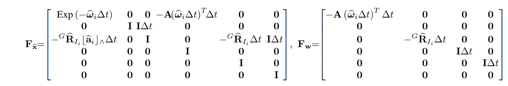
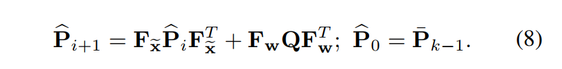

# IEKF的使用
## 运动方程
在最新版本的实现，使用了香港大学的另外一项成功，导致需要读一份源码才能理解。此次贴出公式和新旧两份代码。
公式：

$F_{\delta x}$表示对x的误差变量的导数，$F_w$ 表示对噪声的导数,主要为切空间投影， 式子中表示切空间投影。 
在IMU计算过程中，误差$\delta x$实际是不知道的，但通过导数可以不断更新其协方差。 与观测方程一起，得到对 $\delta x$ 的最大后验概率估计。


```c++
// FAST_LIO 中实现
Eigen::MatrixXd F_x(Eigen::Matrix<double, DIM_OF_STATES, DIM_OF_STATES>::Identity());

    F_x.block<3,3>(0,0)  = Exp(angvel_avr, - dt);
    F_x.block<3,3>(0,9)  = - Eye3d * dt;
    // F_x.block<3,3>(3,0)  = R_imu * off_vel_skew * dt;
    F_x.block<3,3>(3,6)  = Eye3d * dt;
    F_x.block<3,3>(6,0)  = - R_imu * acc_avr_skew * dt;
    F_x.block<3,3>(6,12) = - R_imu * dt;
    F_x.block<3,3>(6,15) = Eye3d * dt;

    Eigen::Matrix3d cov_acc_diag(Eye3d), cov_gyr_diag(Eye3d);
    cov_acc_diag.diagonal() = cov_acc;
    cov_gyr_diag.diagonal() = cov_gyr;
    cov_w.block<3,3>(0,0).diagonal()   = cov_gyr * dt * dt * 10000;
    cov_w.block<3,3>(3,3)              = R_imu * cov_gyr_diag * R_imu.transpose() * dt * dt * 10000;
    cov_w.block<3,3>(6,6)              = R_imu * cov_acc_diag * R_imu.transpose() * dt * dt * 10000;
    cov_w.block<3,3>(9,9).diagonal()   = Eigen::Vector3d(0.0001, 0.0001, 0.0001) * dt * dt; // bias gyro covariance
    cov_w.block<3,3>(12,12).diagonal() = Eigen::Vector3d(0.0001, 0.0001, 0.0001) * dt * dt; // bias acc covariance

    state_inout.cov = F_x * state_inout.cov * F_x.transpose() + cov_w;

```

```c++
// FAST_LIO2 和 FASTER_LIO中的实现
typedef MTK::vect<3, double> vect3;
typedef MTK::SO3<double> SO3;
typedef MTK::S2<double, 98090, 10000, 1> S2;
typedef MTK::vect<1, double> vect1;
typedef MTK::vect<2, double> vect2;

// 23 维 offset_R_L_I 表示 R_il ， 在init_IMU处赋值
MTK_BUILD_MANIFOLD(state_ikfom, ((vect3, pos))((SO3, rot))((SO3, offset_R_L_I))((vect3, offset_T_L_I))((vect3, vel))(
                                    (vect3, bg))((vect3, ba))((S2, grav)));
// 6 维
MTK_BUILD_MANIFOLD(input_ikfom, ((vect3, acc))((vect3, gyro)));

MTK_BUILD_MANIFOLD(process_noise_ikfom, ((vect3, ng))((vect3, na))((vect3, nbg))((vect3, nba)));

MTK::get_cov<process_noise_ikfom>::type process_noise_cov() {
    MTK::get_cov<process_noise_ikfom>::type cov = MTK::get_cov<process_noise_ikfom>::type::Zero();
    MTK::setDiagonal<process_noise_ikfom, vect3, 0>(cov, &process_noise_ikfom::ng, 0.0001);  // 0.03
    MTK::setDiagonal<process_noise_ikfom, vect3, 3>(cov, &process_noise_ikfom::na,
                                                    0.0001);  // *dt 0.01 0.01 * dt * dt 0.05
    MTK::setDiagonal<process_noise_ikfom, vect3, 6>(cov, &process_noise_ikfom::nbg,
                                                    0.00001);  // *dt 0.00001 0.00001 * dt *dt 0.3 //0.001 0.0001 0.01
    MTK::setDiagonal<process_noise_ikfom, vect3, 9>(cov, &process_noise_ikfom::nba,
                                                    0.00001);  // 0.001 0.05 0.0001/out 0.01
    return cov;
}

// double L_offset_to_I[3] = {0.04165, 0.02326, -0.0284}; // Avia
// vect3 Lidar_offset_to_IMU(L_offset_to_I, 3);
// 预处理状体变量，去除偏差， x_(t+1) = x_t + get_f(s,in,0) * dt; 第三个参数为0，表示没有考虑误差
// 此处算是 名义变量
Eigen::Matrix<double, 24, 1> get_f(state_ikfom &s, const input_ikfom &in) {
    Eigen::Matrix<double, 24, 1> res = Eigen::Matrix<double, 24, 1>::Zero();
    vect3 omega;
    in.gyro.boxminus(omega, s.bg); // omega = in.gyro - s.bg;
    vect3 a_inertial = s.rot * (in.acc - s.ba);
    // 预处理后的状态变量
    for (int i = 0; i < 3; i++) {
        res(i) = s.vel[i];
        res(i + 3) = omega[i];
        res(i + 12) = a_inertial[i] + s.grav[i];
    }
    return res;
}

//  $df_dx * \delta x & 为误差。表示目前f的残差分布 
// 真值 $x_(t+1) = x_t + get_f(s,in,0) * dt + df_dx * \delta x$
// 此处代码和论文中不一致，和IKFoM结合使用，了解详细情况需要看论文和IKFoM的实现。
// 旧版本的Fast_LIO中，公式和论文中一致
Eigen::Matrix<double, 24, 23> df_dx(state_ikfom &s, const input_ikfom &in) {
    Eigen::Matrix<double, 24, 23> cov = Eigen::Matrix<double, 24, 23>::Zero();
    cov.template block<3, 3>(0, 12) = Eigen::Matrix3d::Identity();
    vect3 acc_;
    in.acc.boxminus(acc_, s.ba); // in.acc - s.ba
    vect3 omega;
    in.gyro.boxminus(omega, s.bg); // omega = in.gyro - s.bg
    cov.template block<3, 3>(12, 3) = -s.rot.toRotationMatrix() * MTK::hat(acc_);
    cov.template block<3, 3>(12, 18) = -s.rot.toRotationMatrix();
    Eigen::Matrix<state_ikfom::scalar, 2, 1> vec = Eigen::Matrix<state_ikfom::scalar, 2, 1>::Zero();
    Eigen::Matrix<state_ikfom::scalar, 3, 2> grav_matrix;
    s.S2_Mx(grav_matrix, vec, 21);
    // 此处为什么是二维
    cov.template block<3, 2>(12, 21) = grav_matrix;
    cov.template block<3, 3>(3, 15) = -Eigen::Matrix3d::Identity();
    return cov;
}

// 此处是误差进行切空间变化。
Eigen::Matrix<double, 24, 12> df_dw(state_ikfom &s, const input_ikfom &in) {
    Eigen::Matrix<double, 24, 12> cov = Eigen::Matrix<double, 24, 12>::Zero();
    cov.template block<3, 3>(12, 3) = -s.rot.toRotationMatrix();
    cov.template block<3, 3>(3, 0) = -Eigen::Matrix3d::Identity();
    cov.template block<3, 3>(15, 6) = Eigen::Matrix3d::Identity();
    cov.template block<3, 3>(18, 9) = Eigen::Matrix3d::Identity();
    return cov;
}

```