# IMU预积分
IMU预积分主要目的是将频率很高的IMU数据累加。等到其他数据到达后，进行融合。
预计分用到的主要是运动学和李代数的知识。李代数主要使用了一阶近似和伴随性质。
# 问题引出
## 李群视角下的运动学
### 旋转矩阵，角速度
$$
\dot{R} = Rw^{\Lambda} (w瞬时速度) \\
\Delta{R} = Exp(w^{\Lambda} \Delta t)) (瞬时变换，有上式解的)\\
R = R_0 * Exp(w^{\Lambda} \Delta t) 
$$
### 线速度
先考虑一个问题，相机坐标系下的速度如何转为世界坐标系下的速度。如果没有旋转：$ v_w = Rv_c$
如果有旋转呢？ 根据$p_w = R_{wc}p_c + t$，可以得到：$v_w = Rv_c + w \times (Rp_0 + t)$
$$
p_1 = R_{12}p_2 + t  \\
分别对R和p求导 关于时间的导数\\
v_1 = \dot{p_1} = R_{12}v_c + R_{12}w^{\Lambda} p_2 = R_{12} (v_2 + w^{\Lambda}p_2)\\
$$
补充：
p1，p2指什么，v1，v2指什么？ 上述公式有什么物理意义？ 与我们关注的车的速度有什么关系？
- 如果车辆不发生转动，则v1和v2是同一个向量在不同坐标系的转换。如果车辆
发生转动，则不是同一个向量。
- 采用微分的思想，将p当作车辆的位置，v_2车辆的t时刻的瞬时速度（相对于***上一个时刻***车辆坐标系下，该坐标系在一小段时间内是静止的）v2由轮速记提供或者通过IMU计算。
- 实时情况下，在车辆坐标系下，车辆速度始终为0。 
- 下一个车辆坐标系的变换可通过车辆速度计算。

### 线性加速度
对v求导：
$$
a_1 = \dot{v_1} = \dot{R}_{12}（v_2 + w^{\Lambda} p_2） + R_{12} (\dot{v_2} + \dot{w}^{\Lambda} p_2 + w^{\Lambda}\dot{p_2})  \\  = R_{12}w^{\Lambda}(v_2 + w^{\Lambda} p_2) + R_{12}(\dot{v_2} + \dot{w}^{\Lambda} p_2 +  w^{\Lambda}\dot{p_2}) \\ = R_{12} (\dot{v_2} + 2w^{\Lambda} v_2 + \dot{w}^{\Lambda} p_2 + w^{\Lambda} w^{\Lambda} p_2) 
$$
运动中一般舍弃后3项。

## 问题
上述公式中，都是根据商议时刻的值估计当前时刻的值。当IMU数据频率很高时，基于$R_0$, R不断更新，如果优化过程中$R_0$被更新，那么基于$R_0$的估计值就需要重新计算。 当IMU频率很高时，这种计算方式效率较低。缺乏灵活性。

## 解决思路
将$R_0$从公式中排除。计算一段时间（其他传感器的频率）的累加值。 即IMU在一段时间内独立计算，也就是IMU预计分。

## 如何做
字母上方由~的表示可以直接从IMU中读取或者计算，没有的为实际值。
### 原始模型
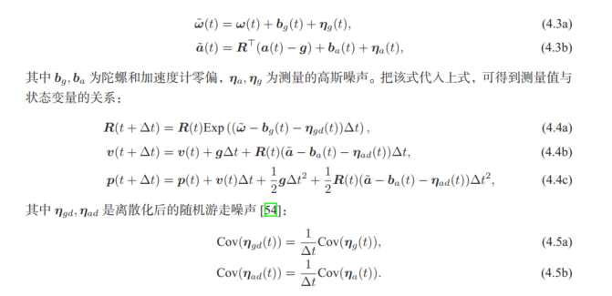
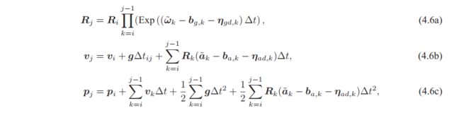
### 将之前的状态变量移除
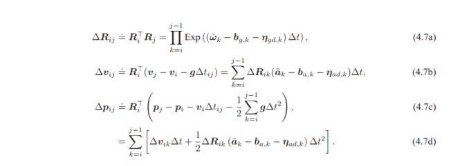
### 将观测到的变量和不确定误差分离
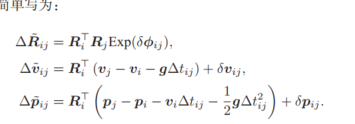
### 计算上述过程中的噪声模型（并递推为累加模式）
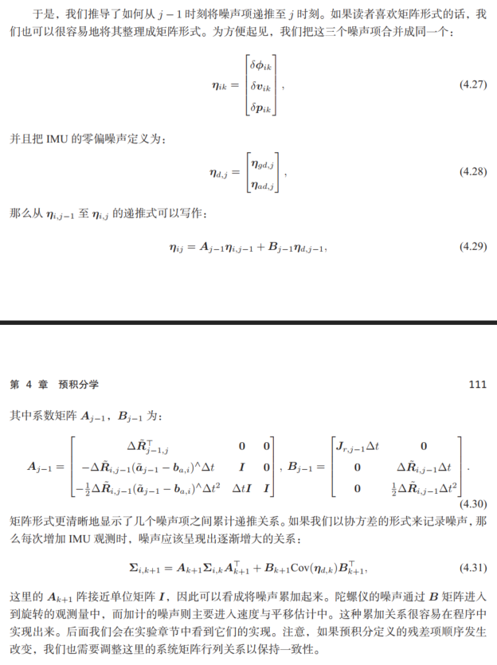
### 零偏的更新
一般情况下不会发生或者很小。上述模型中，当零偏发生时需要重新计算。此处用一阶展开代替。并写成递推模式
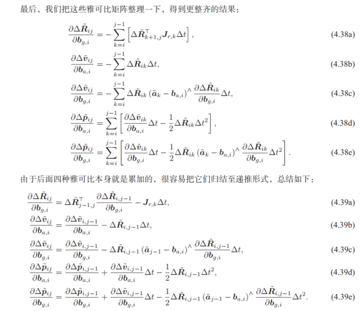

至此完成了图优化的分解

## 基于图优化的使用
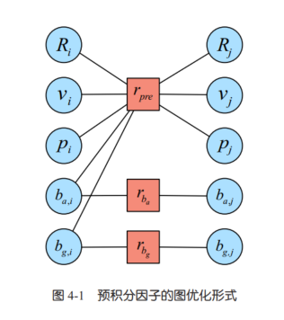
残差的定义，考虑原始模型中如何提取状态无关变量。 
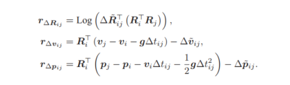


考虑如何使残差减少。
上述残差模型决定了雅可比矩阵的数量。
### 雅可比矩阵
雅可比矩阵主要用于优化$R_i,R_j,V_i,V_j,P_i,P_j$这些变量，求解过程中预计分不发生改变（零偏变化，预计分要变化）。 所以要求残差对$R_i,R_j,V_i,V_j,P_i,P_j$的导数。
- R的残差对$R_i,R_j$的导数
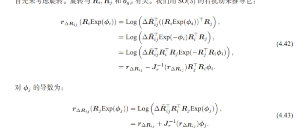
- 对$b_g&

实际使用中，考虑是否要优化$b_g&
- v速度的残差对$V_i,V_j, R_i$的导数
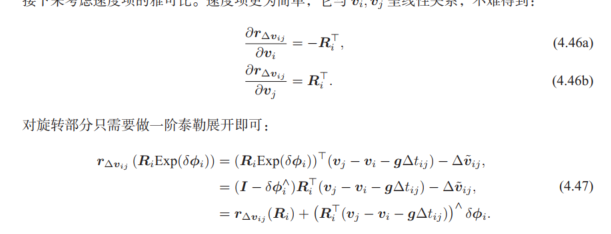
-  v速度的残差对$ b_a, b_g$的导数（取负号），因为$b_a,b_g与\delta v_{ij}$有关

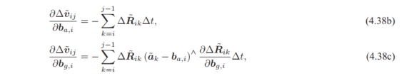

- P对$b_a, b_g$的导数(取负号)

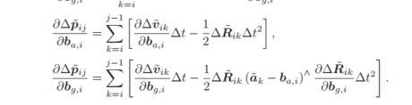
- P对$V_i,p_i,p_j,R_i$的导数

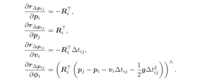

# 源码部分
## 预计分中IMU积分
### 数据结构
```c++
    double dt_ = 0;                          // 整体预积分时间
    Mat9d cov_ = Mat9d::Zero();              // 累计噪声矩阵
    // 根据参数进行初始化
    Mat6d noise_gyro_acce_ = Mat6d::Zero();  // 测量噪声矩阵

    // 零偏
    Vec3d bg_ = Vec3d::Zero();
    Vec3d ba_ = Vec3d::Zero();

    // 预积分观测量
    SO3 dR_;
    Vec3d dv_ = Vec3d::Zero();
    Vec3d dp_ = Vec3d::Zero();

    // 雅可比矩阵, 对零偏的雅可比 用于优化
    Mat3d dR_dbg_ = Mat3d::Zero();
    Mat3d dV_dbg_ = Mat3d::Zero();
    Mat3d dV_dba_ = Mat3d::Zero();
    Mat3d dP_dbg_ = Mat3d::Zero();
    Mat3d dP_dba_ = Mat3d::Zero();
```
### 积分过程
```c++
void IMUPreintegration::Integrate(const IMU &imu, double dt) {
    // 去掉零偏的测量
    Vec3d gyr = imu.gyro_ - bg_;  // 陀螺
    Vec3d acc = imu.acce_ - ba_;  // 加计

    // 更新dv, dp, 见(4.13), (4.16) 
    dp_ = dp_ + dv_ * dt + 0.5f * dR_.matrix() * acc * dt * dt;
    dv_ = dv_ + dR_ * acc * dt;

    // dR先不更新，因为A, B阵还需要现在的dR

    // 运动方程雅可比矩阵系数，A,B阵，见(4.29)
    // 另外两项在后面
    Eigen::Matrix<double, 9, 9> A;
    A.setIdentity();
    Eigen::Matrix<double, 9, 6> B;
    B.setZero();

    Mat3d acc_hat = SO3::hat(acc);
    double dt2 = dt * dt;

    // NOTE A, B左上角块与公式稍有不同
    A.block<3, 3>(3, 0) = -dR_.matrix() * dt * acc_hat;
    A.block<3, 3>(6, 0) = -0.5f * dR_.matrix() * acc_hat * dt2;
    A.block<3, 3>(6, 3) = dt * Mat3d::Identity();

    B.block<3, 3>(3, 3) = dR_.matrix() * dt;
    B.block<3, 3>(6, 3) = 0.5f * dR_.matrix() * dt2;

    // 更新各雅可比，见式(4.39)
    dP_dba_ = dP_dba_ + dV_dba_ * dt - 0.5f * dR_.matrix() * dt2;                      // (4.39d)
    dP_dbg_ = dP_dbg_ + dV_dbg_ * dt - 0.5f * dR_.matrix() * dt2 * acc_hat * dR_dbg_;  // (4.39e)
    dV_dba_ = dV_dba_ - dR_.matrix() * dt;                                             // (4.39b)
    dV_dbg_ = dV_dbg_ - dR_.matrix() * dt * acc_hat * dR_dbg_;                         // (4.39c)

    // 旋转部分
    Vec3d omega = gyr * dt;         // 转动量
    Mat3d rightJ = SO3::jr(omega);  // 右雅可比
    SO3 deltaR = SO3::exp(omega);   // exp后
    dR_ = dR_ * deltaR;             // (4.9)

    A.block<3, 3>(0, 0) = deltaR.matrix().transpose();
    B.block<3, 3>(0, 0) = rightJ * dt;

    // 更新噪声项
    cov_ = A * cov_ * A.transpose() + B * noise_gyro_acce_ * B.transpose();

    // 更新dR_dbg
    dR_dbg_ = deltaR.matrix().transpose() * dR_dbg_ - rightJ * dt;  // (4.39a)

    // 增量积分时间
    dt_ += dt;
}
```
## 预积分边
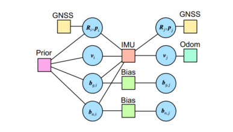
预计分的边一共约束上上一时刻15维状态和下一时刻9维状态，复杂。
1. 思考多个残差对同一个变量有约束条件如何表示。
2. 思考变量维数不同不同如何处理。
3. 思考边的边的维数如何定义。
### 计算误差
边的维数取决于误差的维数，IMU误差的维数为9.
```c++
class EdgeInertial : public g2o::BaseMultiEdge<9, Vec9d>
```
误差应该使用一个9维向量表示，分别计算，然后合并
```c++
void EdgeInertial::computeError() {
  auto *p1 = dynamic_cast<const VertexPose *>(_vertices[0]);
  auto *v1 = dynamic_cast<const VertexVelocity *>(_vertices[1]);
  auto *bg1 = dynamic_cast<const VertexGyroBias *>(_vertices[2]);
  auto *ba1 = dynamic_cast<const VertexAccBias *>(_vertices[3]);
  auto *p2 = dynamic_cast<const VertexPose *>(_vertices[4]);
  auto *v2 = dynamic_cast<const VertexVelocity *>(_vertices[5]);

  Vec3d bg = bg1->estimate();
  Vec3d ba = ba1->estimate();

  const SO3 dR = preint_->GetDeltaRotation(bg);
  const Vec3d dv = preint_->GetDeltaVelocity(bg, ba);
  const Vec3d dp = preint_->GetDeltaPosition(bg, ba);

  /// 预积分误差项（4.41），书中称为残差
  
  const Vec3d er =
      (dR.inverse() * p1->estimate().so3().inverse() * p2->estimate().so3())
          .log();
  Mat3d RiT = p1->estimate().so3().inverse().matrix();
  const Vec3d ev = RiT * (v2->estimate() - v1->estimate() - grav_ * dt_) - dv;
  const Vec3d ep =
      RiT * (p2->estimate().translation() - p1->estimate().translation() -
             v1->estimate() * dt_ - grav_ * dt_ * dt_ / 2) -
      dp;
  _error << er, ev, ep;
}

```
### 计算雅可比
回答第一个问题：
1. 残差是9维向量，矩阵为残差对变量的雅可比矩阵，应该是9*n的矩阵，n取决于变量的维数。
2. 行顺序上，应该为变量分别对 er, ev, ep的导数。
```c++
void EdgeInertial::linearizeOplus() {
  auto *p1 = dynamic_cast<const VertexPose *>(_vertices[0]);
  auto *v1 = dynamic_cast<const VertexVelocity *>(_vertices[1]);
  auto *bg1 = dynamic_cast<const VertexGyroBias *>(_vertices[2]);
  auto *ba1 = dynamic_cast<const VertexAccBias *>(_vertices[3]);
  auto *p2 = dynamic_cast<const VertexPose *>(_vertices[4]);
  auto *v2 = dynamic_cast<const VertexVelocity *>(_vertices[5]);

  Vec3d bg = bg1->estimate();
  Vec3d ba = ba1->estimate();
  Vec3d dbg = bg - preint_->bg_;

  // 一些中间符号
  const SO3 R1 = p1->estimate().so3();
  const SO3 R1T = R1.inverse();
  const SO3 R2 = p2->estimate().so3();

  auto dR_dbg = preint_->dR_dbg_;
  auto dv_dbg = preint_->dV_dbg_;
  auto dp_dbg = preint_->dP_dbg_;
  auto dv_dba = preint_->dV_dba_;
  auto dp_dba = preint_->dP_dba_;

  // 估计值
  Vec3d vi = v1->estimate();
  Vec3d vj = v2->estimate();
  Vec3d pi = p1->estimate().translation();
  Vec3d pj = p2->estimate().translation();

  const SO3 dR = preint_->GetDeltaRotation(bg);
  const SO3 eR = SO3(dR).inverse() * R1T * R2;
  const Vec3d er = eR.log();
  const Mat3d invJr = SO3::jr_inv(eR);

  /// 雅可比矩阵
  /// 注意有3个index, 顶点的，自己误差的，顶点内部变量的
  /// 变量顺序：pose1(R1,p1), v1, bg1, ba1, pose2(R2,p2), v2
  /// 残差顺序：eR, ev, ep，残差顺序为行，变量顺序为列

  //       | R1 | p1 | v1 | bg1 | ba1 | R2 | p2 | v2 |
  //  vert | 0       | 1  | 2   | 3   | 4       | 5  |
  //  col  | 0    3  | 0  | 0   | 0   | 0    3  | 0  |
  //    row
  //  eR 0 |
  //  ev 3 |
  //  ep 6 |

  /// 残差对R1, 9x3
  _jacobianOplus[0].setZero();
  // dR/dR1, 4.42
  _jacobianOplus[0].block<3, 3>(0, 0) = -invJr * (R2.inverse() * R1).matrix();
  // dv/dR1, 4.47
  _jacobianOplus[0].block<3, 3>(3, 0) = SO3::hat(R1T * (vj - vi - grav_ * dt_));
  // dp/dR1, 4.48d
  _jacobianOplus[0].block<3, 3>(6, 0) = SO3::hat(
      R1T * (pj - pi - v1->estimate() * dt_ - 0.5 * grav_ * dt_ * dt_));

  /// 残差对p1, 9x3
  // dp/dp1, 4.48a
  _jacobianOplus[0].block<3, 3>(6, 3) = -R1T.matrix();

  /// 残差对v1, 9x3
  _jacobianOplus[1].setZero();
  // dv/dv1, 4.46a
  _jacobianOplus[1].block<3, 3>(3, 0) = -R1T.matrix();
  // dp/dv1, 4.48c
  _jacobianOplus[1].block<3, 3>(6, 0) = -R1T.matrix() * dt_;

  /// 残差对bg1
  _jacobianOplus[2].setZero();
  // dR/dbg1, 4.45
  _jacobianOplus[2].block<3, 3>(0, 0) =
      -invJr * eR.inverse().matrix() * SO3::jr((dR_dbg * dbg).eval()) * dR_dbg;
  // dv/dbg1
  _jacobianOplus[2].block<3, 3>(3, 0) = -dv_dbg;
  // dp/dbg1
  _jacobianOplus[2].block<3, 3>(6, 0) = -dp_dbg;

  /// 残差对ba1
  _jacobianOplus[3].setZero();
  // dv/dba1
  _jacobianOplus[3].block<3, 3>(3, 0) = -dv_dba;
  // dp/dba1
  _jacobianOplus[3].block<3, 3>(6, 0) = -dp_dba;

  /// 残差对pose2
  _jacobianOplus[4].setZero();
  // dr/dr2, 4.43
  _jacobianOplus[4].block<3, 3>(0, 0) = invJr;
  // dp/dp2, 4.48b
  _jacobianOplus[4].block<3, 3>(6, 3) = R1T.matrix();

  /// 残差对v2
  _jacobianOplus[5].setZero();
  // dv/dv2, 4,46b
  _jacobianOplus[5].block<3, 3>(3, 0) = R1T.matrix(); // OK
}
```