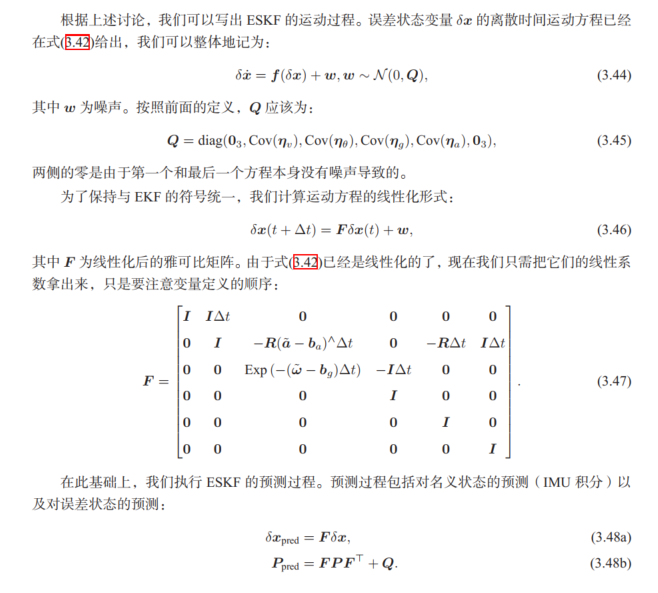
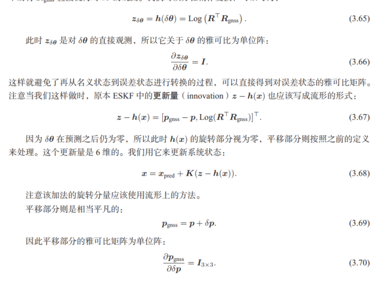
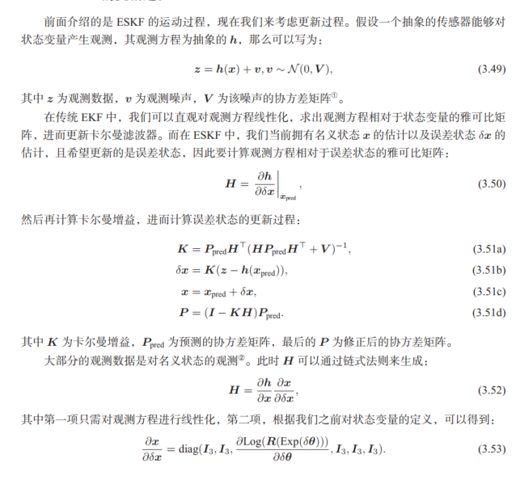
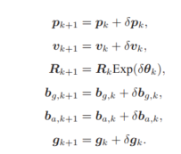
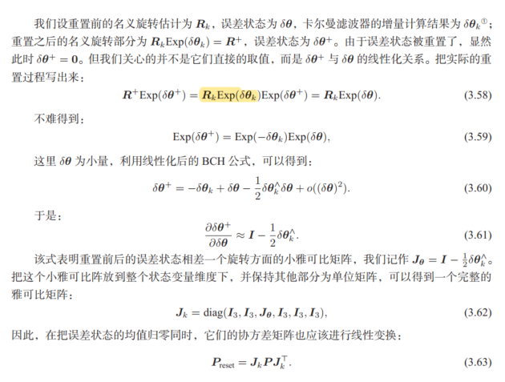

# 卡尔曼滤波器

$$
x_k = A_kx_{k-1} + u_k +w_k  ~~~~[1] 
 \\ w_k 服从 N(0,R) \\
z_k = C_kx_k + v_k ~~~~~[2] \\
v_k 服从 N(0,Q)
$$

上述（1）（2）都可以独立对$x_k$进行计算，但通常情况下，二者不相同。最优估计需要综合考虑二者，计算出最佳$x_k^+$。 卡尔曼滤波器就是为了解答上述问题。

$$
x_k^+ = x_k^- + K(z_k - z_k^-) ~~~~~[3]
\\ x_k^- = A_kx_{k-1} +u_k \\
z_k^- = C_kx_k^-
$$

式3中如何求取K是关键。 下面使用最大似然估计法（最大后验概率）进行计算。
$$
N(x_k^+,P_k^+) = \theta N(C_kx_k，Q) N(x_k^-,P_k^-) ~~~[4]\\
P_K^- = A_kP_{k-1}^+A_k^T + R \\
P_K为x向量的不确定度（只有预测方程的情况下不断增大）\\
\theta N(C_kx_k，Q) 似然函数 \\
N(x_k^-,P_k^-) 先验分布
$$

求解方法是将【4】的指数部分展开，分别计算P_k和x_k。

可计算出

$$
K = P_K^-C_K^T(C_kP_K^-C_K^T+Q_k)^{-1} \\
x_k^+ = x_k^- + K(z_k - C_kx_k^-) \\ P_K^+ = (I - KC_k)P_k^-
$$

## ESKF
## 隐变量的一阶导
此处隐变量指误差
### 运动学方程导数模型
$$
 \dot p_t = v_t \\
 \dot v_t = R_t(\tilde a - b_{at} - \eta_a) + g_t \\
 \dot R_t = R_t(\tilde w - b_{gt} - \eta_g)^{\Lambda} \\
 \dot b_{gt} = {\eta}_{bg} \\
 \dot b_{at} = {\eta}_{ba}
$$
### 分离误差
$$
p_t = p + \delta p \\
v_t = v + \delta v \\
R_t = R * \delta R \\
b_{gt} = b_{gt} + \delta b_{gt} \\
b_{at} = b_{at} + \delta b_{at}
$$
不带下标的为名义变量，从IMU读数中直接计算。另一部分为误差变量，需要结合观测值进行最佳估计。如果没有其他观测，则误差变量为0.
### 误差导数
计算误差变化的方法为 对分离误差后的式子求导（分别对名义变量和误差误差变量就行求导，），求导结果和导数模型相等。
求导结果为：
$$
\delta \dot p = \delta v \\
\delta \dot v = - R(\tilde a - b_{a})^{\Lambda}\delta \theta - R\delta b_a - \eta_a + \delta g \\
\delta \dot R = - (\tilde w - b_{g})^{\Lambda}\delta \theta - R\delta b_g - \eta_g \\
\delta \dot b_{g} = {\eta}_{bg} \\
\delta \dot b_{a} = {\eta}_{ba}
$$
### 计算误差

式子中 $\delta p ,\delta v , \delta\theta$为t时刻的误差，一般为0。求解R时用微分方程。 

这个式子在实际使用中，主要用于推导协方差的变化。四个原始变量的标准差为
$$
\sigma{(\eta_v)} = \Delta t_2 \sigma_a(k) = \Delta t (\sigma_a / \sqrt {\Delta t_1})  \\
\sigma{(\eta_g)} = \Delta t_2 \sigma_w(k) = \Delta t (\sigma_w / \sqrt {\Delta t_1}) \\
\sigma(\eta_{bg}) = \sqrt{ \Delta t_1 } \sigma_{bg} \\
\sigma(\eta_{ba}) = \sqrt{ \Delta t_1 } \sigma_{ba}

$$
t1由采样间隔决定，t_2为误差累积时间。
### 总结

## 观测变量
使用$R_gnss作为观测变量$

## 更新

之后$\delta x  = 0$
此时，会出现一个问题。$R\delta R$为非线性变化，会导致高斯分布的协方差发生改变。为了维持高斯分布，此处采用一阶导替代。将R处的高斯分布投影到$R\delta R$处，称为切空间投影。

